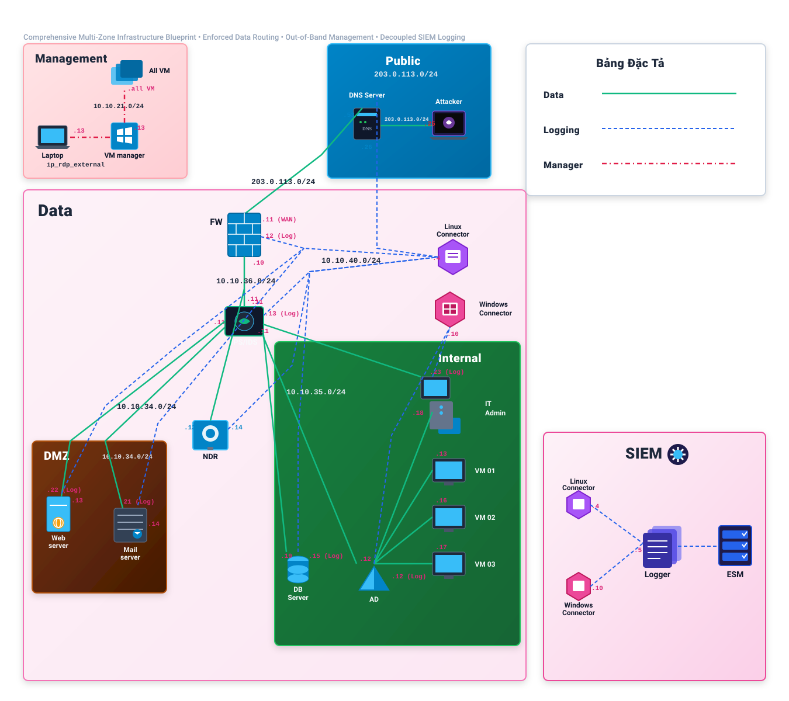

# Enterprise SOC Lab
### Network Security, SIEM Detection & Incident Investigation

A hands-on enterprise-style security laboratory integrating perimeter firewall enforcement, inline intrusion prevention (IPS), passive network detection (NDR), kernel-level endpoint auditing, centralized log normalization (CEF), real-time SIEM correlation, and evidence-driven incident investigation.

---

## Architecture Overview



---

## Project at a Glance

| Architectural Domain | Implemented Technology | Primary Operational Role | Telemetry & Ingestion |
| :--- | :--- | :--- | :--- |
| **Boundary Routing & Firewall** | **pfSense** | Perimeter ingress/egress filtering, state tracking, and NAT. | Filterlog via Syslog $\rightarrow$ SmartConnector |
| **Inline Intrusion Prevention** | **Suricata** | Layer-7 deep packet inspection and inline payload blocking (NFQUEUE). | EVE JSON alerts $\rightarrow$ SmartConnector |
| **Network Traffic Analysis (NDR)**| **Zeek (Bro)** | Passive network flow metadata and session duration analysis. | `conn.log` TSV $\rightarrow$ SmartConnector |
| **Windows Endpoint Telemetry** | **Microsoft Sysmon** | Kernel-level process creation (ID 1), network connections (ID 3). | Windows Event Log (WEC) $\rightarrow$ SmartConnector |
| **PowerShell Auditing** | **Windows ScriptBlock**| De-obfuscated script block content logging (Event ID 4104). | Windows Event Log (WEC) $\rightarrow$ SmartConnector |
| **Identity & Governance** | **Active Directory DS**| Domain authentication and Kerberos ticket auditing (4768/4769). | Security Event Log $\rightarrow$ SmartConnector |
| **Linux Host Auditing** | **Linux Auditd** | System call interception (`execve`) and container execution. | `audit.log` via Rsyslog $\rightarrow$ SmartConnector |
| **Mail Gateway & Delivery** | **Postfix / Dovecot** | Inbound SMTP routing, DKIM/SPF verification, and local delivery. | Postfix Syslog $\rightarrow$ SmartConnector |
| **Database Activity Monitoring** | **MariaDB Server** | Relational storage and SQL query auditing (`SERVER_AUDIT`). | Syslog $\rightarrow$ SmartConnector |
| **SIEM Log Retention & Search** | **ArcSight Logger** | High-capacity immutable storage, SHA-256 event hashing, ad-hoc search. | Indexed CEF Store / SQL Search |
| **Real-Time SIEM Correlation** | **ArcSight ESM** | In-memory correlation rules (`A01`–`A13`, `C01`) and Active Channels. | Real-Time Correlation Engine |
| **Adversary Simulation Platform** | **Kali Linux** | Structured red-team attack simulation across 4 lifecycle phases. | External Attacker (`203.0.113.25`) |

---

## Security Architecture Summary

The security architecture is organized around two complementary, enforced pipelines:

### 1. The Enforced Traffic Path
All inter-zone network traffic must traverse dedicated physical and logical inspection boundaries:
```text
EXTERNAL_NET (203.0.113.0/24)
       │
       ▼ [pfSense Perimeter Firewall (10.10.36.10)]
SECURITY_TRANSIT (10.10.36.0/24)
       │
       ▼ [Suricata Inline IPS (10.10.36.11)]
ENTERPRISE MONITORED ZONES
   ├── DMZ_NET (10.10.34.0/24)        ──► WEB01 (Nginx/Docker), MAIL01 (Postfix)
   └── INTERNAL_NET (10.10.35.0/24)   ──► DC01 (AD DS), IT-ADMIN01 (Workstation), DB01 (MariaDB)
```
* **Security Transit Choke Point**: Inter-zone routing between DMZ and Internal zones is routed through the Security Transit segment, forcing all cross-boundary communications through pfSense stateful filtering and Suricata DPI.
* **Compensatory Host Controls**: Because same-subnet Layer-2 communications (e.g., between `IT-ADMIN01` and `DB01`) switch directly across the virtual switch fabric without hitting the default gateway, host-based `iptables` rules on `DB01` act as a compensatory access control layer.

### 2. The Decoupled SIEM Telemetry Pipeline
Telemetry is decoupled between forensic cold storage and real-time analytical evaluation:
```text
[ Multi-Source Endpoints & Sensors ] 
                 │
                 ▼
[ ArcSight SmartConnector (10.10.40.4) ] ──► Ingestion & Common Event Format (CEF) Normalization
                 │
                 ├───► [ ArcSight Logger (10.10.40.5) ]  ──► Cold Retention & Ad-Hoc Forensic SQL Queries
                 └───► [ ArcSight ESM (10.10.21.10) ]   ──► Real-Time Rules Engine & Active Channel Alerts
```

For complete technical specifications, see [System Architecture](docs/02_SYSTEM_ARCHITECTURE.md) and [Network Architecture](docs/03_NETWORK_ARCHITECTURE.md).

---

## What This Project Demonstrates

* **Multi-Zone Network Segmentation**: VLAN-based broadcast domain isolation with enforced transit choke points.
* **Inline IPS Deployment**: Suricata operating in NFQUEUE inline mode for active payload inspection and drop enforcement.
* **Passive Network Monitoring**: Zeek extracting session durations, protocol metadata, and byte volumetrics without latency impact.
* **High-Fidelity Endpoint Auditing**: Sysmon XML configuration capturing process trees, command lines, and network socket bindings.
* **SIEM Event Normalization**: Parsing heterogenous logs into standardized Common Event Format (CEF) fields.
* **Stateful Real-Time Correlation**: Joining independent perimeter, host, and network events into composite security incidents.
* **Evidence-Driven Incident Investigation**: Methodical hypothesis testing, timeline reconstruction, and cross-source pivoting.
* **Transparent Limitation Analysis**: Documenting architectural blind spots, threshold evasions, and scenario-dependent constraints.

---

## Detection Engineering Portfolio

The lab deploys **13 atomic detection rules (`A01`–`A13`)** and **1 composite multi-source correlation rule (`C01`)** operating within ArcSight ESM:

| Rule ID | Detection Name | Telemetry Source | Observable Behavior | Correlation Type | Rule Details |
| :--- | :--- | :--- | :--- | :--- | :---: |
| **A01** | Mail Delivered to Internal User | Postfix Syslog | Mail delivery to mailbox | Contextual Baseline | [Read Rule](detection/A01/README.md) |
| **A02** | Suspicious External Web Download | Suricata IPS | HTTP GET payload archive download | Network Ingress | [Read Rule](detection/A02/README.md) |
| **A03** | Suspicious Script Execution | Sysmon Event ID 1 | `mshta.exe` executing `.hta` file | Host Living-off-the-Land | [Read Rule](detection/A03/README.md) |
| **A04** | Suspicious Outbound Callback | Zeek `conn.log` | Persistent TCP callback on port 4444 | Network Callback | [Read Rule](detection/A04/README.md) |
| **A05** | Post-Compromise Discovery Burst | Sysmon Event ID 1 | $\ge 3$ diagnostic commands in 5 min | Host Sliding Window | [Read Rule](detection/A05/README.md) |
| **A06** | Credential Material Collection | Sysmon Event ID 1 | `xcopy` copying browser profile | Host Endpoint | [Read Rule](detection/A06/README.md) |
| **A07** | Suspicious Data Staging / Transfer | PowerShell (4104) | `.NET TcpClient` socket streaming | ScriptBlock Logging | [Read Rule](detection/A07/README.md) |
| **A08** | Suspicious Tool Transfer / Exec | PS 4104 / Sysmon 1| `certutil` ingress / agent execution | Tool Ingress | [Read Rule](detection/A08/README.md) |
| **A09** | Suspicious External Tunnel | Sysmon ID 3 / Zeek | Outbound connection to port 11601 | Network Tunneling | [Read Rule](detection/A09/README.md) |
| **A10** | Internal Remote Access to Web | Suricata IPS | SSH from Internal (`.18`) to DMZ (`.13`) | Lateral Movement Pivot | [Read Rule](detection/A10/README.md) |
| **A11** | Privileged Sudo Docker Exec | Linux Auditd | Sudo `docker exec` container command | Container Abuse | [Read Rule](detection/A11/README.md) |
| **A12** | Database Structural Enumeration | MariaDB Audit | `TABLE` / `QUERY` extraction commands | Database Activity | [Read Rule](detection/A12/README.md) |
| **A13** | DMZ Exfiltration Stream | Suricata IPS | Outbound TCP transfer on port 9999 | Staging Exfiltration | [Read Rule](detection/A13/README.md) |
| **C01** | Initial Compromise Correlation | Multi-Source | Stateful join: `A02` + `A03` + `A04` ($\Delta t \le 20\text{m}$) | **Composite ESM Correlation** | [Read Rule](detection/C01/README.md) |

For validation results and test matrices, explore the [Detection Engineering Hub](detection/README.md).

---

## Incident Investigation Case Studies

Every simulation generated empirical event traces investigated through structured forensic workflows:

### [Case 001 — Initial Compromise Investigation](investigation/case-001/README.md)
* **Summary**: ESM triggers composite alert `C01`. Analyst investigates spearphishing delivery on `MAIL01`, traces `mshta.exe` process spawning hidden PowerShell on `IT-ADMIN01`, and confirms an active reverse shell on port 4444 via Zeek.
* **Key Evidence**: `DET-001`–`004`, `INV-001` (Postfix QueueID), `INV-002` (Sysmon Process Tree), `VIDEO-02`.

### [Case 002 — Post-Compromise Host Discovery](investigation/case-002/README.md)
* **Summary**: Analyst responds to threshold alert `A05`. Evaluates sliding-window burst of 6 reconnaissance commands executed in under 60 seconds and reconstructs the attacker's situational awareness trajectory.
* **Key Evidence**: `INV-003` (Command Burst Timeline), `TEL-001` (Sysmon Event ID 1), `VIDEO-02`.

### [Case 003 — Credential Staging & Proxy Ingress](investigation/case-003/README.md)
* **Summary**: Analyst detects `xcopy` targeting Chrome browser databases (`A06`), decodes PowerShell ScriptBlock 4104 de-obfuscation capturing raw socket exfiltration on port 11601 (`A07`), and identifies `certutil` downloading a tunneling agent (`A08`).
* **Key Evidence**: `INV-004` (ScriptBlock 4104 Decompression), `TEL-002`, `VIDEO-02`, `VIDEO-03`.

### [Case 004 — Inter-Zone Lateral Movement & Database Dump](investigation/case-004/README.md)
* **Summary**: Analyst tracks lateral movement from Internal workstation to DMZ web server via SSH (`A10`), traces container privilege abuse via Linux Auditd (`A11`), and uncovers database schema theft via MariaDB Audit Plugin logs (`A12`).
* **Key Evidence**: `ARCH-001`–`003`, `INV-005` (SSH traceback), `INV-006` (Auditd docker exec), `INV-007` (MariaDB query dump), `VIDEO-02`, `VIDEO-03`.

### [Case 005 — DMZ Exfiltration & Remediation](investigation/case-005/README.md)
* **Summary**: Suricata IPS triggers alert `A13` on outbound TCP port 9999. Analyst calculates transfer volumetrics, correlates Netcat staging commands, validates perimeter firewall drop rules, and enforces enterprise-wide credential revocation.
* **Key Evidence**: `DET-005` (Suricata SID 1101021), `INV-008` (Flow Volumetrics), `RESP-002` (pfSense Drop Logs), `VIDEO-02`, `VIDEO-03`.

---

## Demonstrations

The laboratory includes screen-recorded technical demonstrations hosted externally on **YouTube as Unlisted videos**:

| Video ID & Title | Type | Scope & Demonstrated Workflow | YouTube Link | Technical Details |
| :--- | :--- | :--- | :---: | :---: |
| **01 — Attack Simulation**<br/>`[SOC Attack Simulation] Multi-Stage Adversary Intrusion & Detection Validation` | Red Team Simulation | Multi-stage intrusion: Phishing delivery, LOLBin HTA execution, reverse shell callback, host discovery burst, credential harvesting, tool staging, SSH lateral pivot, container abuse, and DMZ data exfiltration. | `YOUTUBE_URL_PENDING` | [Documentation](media/attack-simulation/VIDEO-01.md) |
| **02 — Full Investigation**<br/>`[SOC Investigation] Full Incident Investigation Walkthrough: From Ingress to Containment` | Blue Team Primary Investigation | Complete end-to-end incident investigation: ESM Active Channel triage of composite alert `C01`, Sysmon `ProcessGuid` lineage reconstruction, Zeek callback validation, Postfix mail backtracking, lateral pivot triage, and perimeter firewall drop verification. | `YOUTUBE_URL_PENDING` | [Documentation](media/investigation/VIDEO-02-FULL.md) |
| **03 — Investigation Supplement**<br/>`[SOC Investigation] Supplementary Walkthrough: Deep Forensics & Secondary Pivots` | Blue Team Supplementary Deep-Dive | Technical companion expanding Video 02: PowerShell ScriptBlock 4104 payload reassembly, Linux Auditd `execve` container tracing, hardware Layer-2 ARP bypass analysis and host `iptables` defense on `DB01`, MariaDB `SERVER_AUDIT` query extraction, and microsecond pfSense filterlog drop inspection. | `YOUTUBE_URL_PENDING` | [Documentation](media/investigation/VIDEO-03-SUPPLEMENT.md) |

> [!NOTE]
> Video publication is pending. Sanitized YouTube links will be added after final review; all core technical documentation and artifacts are already available in this repository. All recordings are currently staged locally pending pre-upload sanitization audit. See [Media Specification](media/README.md) for description templates and the [Video Sanitization Checklist](media/VIDEO_SANITIZATION_CHECKLIST.md).

---


## Engineering Workflow

The core technical story of this laboratory follows an empirical engineering lifecycle:

```text
  1. ARCHITECTURE     ──► Segment physical vSwitches, configure pfSense routing, deploy Suricata IPS.
         │
  2. TELEMETRY        ──► Instrument Sysmon, Auditd, MariaDB Audit, and Zeek into SmartConnectors (CEF).
         │
  3. DETECTION        ──► Engineer atomic rules (A01–A13) and composite ESM correlation (C01).
         │
  4. SIMULATION       ──► Execute structured Red Team intrusion scenarios from Kali (203.0.113.25).
         │
  5. INVESTIGATION    ──► Triage ESM alerts, execute ad-hoc Logger queries, assemble forensic timelines.
         │
  6. EVIDENCE         ──► Curate immutable log hashes, process lineages, and firewall drop records.
         │
  7. HARDENING        ──► Deploy iptables controls, tighten firewall rules, tune correlation windows.
```

---

## Recommended Reading Path

Depending on your professional focus, explore the repository via these paths:

### Fast Path (10-Minute Executive Overview)
1. Review the [Level 1 Architecture Diagram](architecture/enterprise-soc-overview.svg).
2. Inspect the [Composite Correlation Rule C01](detection/C01/README.md).
3. Read [Incident Investigation Case 001](investigation/case-001/README.md).
4. Review the [Claim-to-Evidence Matrix](evidence/CLAIM_EVIDENCE_MATRIX.md).

### Deep Technical Path (Architecture & Detection Engineering)
1. Read the [Project Overview](docs/01_PROJECT_OVERVIEW.md) and [System Architecture](docs/02_SYSTEM_ARCHITECTURE.md).
2. Study [Network Architecture](docs/03_NETWORK_ARCHITECTURE.md) and the [Network Security Flow](architecture/network-security-flow.svg).
3. Examine [Full-Stack Telemetry Architecture](docs/05_TELEMETRY_ARCHITECTURE.md) and [CEF Normalization](evidence/telemetry/README.md).
4. Evaluate the [Detection Engineering Portfolio](detection/README.md) and [Validation Matrix](detection/VALIDATION_MATRIX.md).
5. Walk through all five [Incident Investigation Case Studies](investigation/README.md).
6. Inspect the curated [Evidence Index](evidence/EVIDENCE_INDEX.md) and [Engineering Decisions](docs/ENGINEERING_DECISIONS.md).

---

## Known Limitations

In the interest of technical credibility, several operational constraints must be recognized:
* **Layer-2 Switching Bypass**: Same-subnet communications (e.g., `IT-ADMIN01` to `DB01`) bypass perimeter gateway inspection; host-based `iptables` rules on `DB01` are required as compensatory controls.
* **Scenario-Dependent Ports**: Detections `A04` (port 4444), `A09` (port 11601), and `A13` (port 9999) evaluate specific simulation ports rather than generic behavioral anomalies.
* **Threshold Window Evasion**: Rule `A05` requires $\ge 3$ commands in 5 minutes; automated low-and-slow execution exceeding this interval avoids detection.
* **Encrypted Traffic Blind Spots**: In the absence of SSL/TLS inspection, HTTP payload signatures (such as Suricata SID 1101002 in `A02`) cannot inspect HTTPS content.

For an exhaustive evaluation, see [Detection Engineering Limitations](docs/08_DETECTION_LIMITATIONS.md).

---

## Public-Safe Design Statement

All infrastructure identifiers throughout this public repository have been normalized using canonical public aliases:
* Real internal subnets are mapped to canonical RFC 1918 `10.10.0.0/16` and RFC 5737 `203.0.113.0/24`.
* Plaintext credentials, passwords, cryptographic private keys, and session tokens have been removed and replaced with standardized synthetic tokens (`P@ssw0rd2024!_DEMO`, `[REDACTED_SECRET]`).
* Real employee names, university affiliations, and intern identities have been omitted.
* Complete physical network topologies, routing tables, and CEF schema field keys are 100% preserved.

For full classification details, see [Public vs. Private Boundary](docs/PUBLIC_PRIVATE_BOUNDARY.md).

---

## Repository Structure

```text
Enterprise-SOC-Lab/
├── README.md                          <-- You are here (Repository Entry Point)
├── LICENSE                            <-- Licensing terms & conditions
├── SECURITY.md                        <-- Security policy & reporting guidelines
├── CONTRIBUTING.md                    <-- Contribution & modification policies
├── .gitignore                         <-- Strict exclusion rules for private assets
│
├── docs/                              <-- Deep-dive architecture and SOC documentation
│   ├── README.md                      <-- Documentation index & reading guides
│   ├── 01_PROJECT_OVERVIEW.md         <-- Project scope, objectives, and summary
│   ├── 02_SYSTEM_ARCHITECTURE.md      <-- 7-layer functional architecture
│   ├── 03_NETWORK_ARCHITECTURE.md     <-- Multi-zone segmentation & routing tables
│   ├── 04_SECURITY_ARCHITECTURE.md    <-- Defense-in-depth & enforcement controls
│   ├── 05_TELEMETRY_ARCHITECTURE.md   <-- Telemetry pipeline & sensor instrumentation
│   ├── 06_SOC_OPERATING_MODEL.md      <-- Tier-1/2/3 triage & escalation models
│   ├── 07_DETECTION_ENGINEERING.md    <-- Normalization models & correlation logic
│   ├── 08_DETECTION_LIMITATIONS.md    <-- Operational boundaries & trade-offs
│   ├── TECHNOLOGY_STACK.md            <-- Confirmed hardware & software inventory
│   ├── ENGINEERING_DECISIONS.md       <-- Rationale behind 5 core design choices
│   └── PUBLIC_PRIVATE_BOUNDARY.md     <-- Asset publication classification matrix
│
├── architecture/                      <-- Standalone vector diagrams & style guides
│   ├── README.md                      <-- Diagram directory & recommended order
│   ├── DIAGRAM_STYLE_GUIDE.md         <-- Visual standards, typography, and palette
│   ├── enterprise-soc-overview.svg    <-- Level 1: System overview vector graphic
│   ├── network-security-flow.svg      <-- Level 2: Network inspection & L2 bypass
│   ├── telemetry-flow.svg             <-- Level 3: Ingestion, normalization & SIEM
│   ├── detection-flow.svg             <-- Level 4: Detection & correlation graph
│   └── investigation-workflow.svg     <-- Level 5: Incident investigation lifecycle
│
├── detection/                         <-- Detection engineering portfolio
│   ├── README.md                      <-- Detection hub, philosophy & inventory
│   ├── VALIDATION_MATRIX.md           <-- Empirical firing & validation records
│   ├── A01/ ... A13/                  <-- Atomic detection specifications
│   ├── C01/                           <-- Multi-source composite correlation rule
│   └── queries/                       <-- Production ArcSight Logger search syntax
│
├── investigation/                     <-- Forensic incident investigation cases
│   ├── README.md                      <-- Case study hub & forensic taxonomy
│   ├── CASE_DETECTION_MATRIX.md       <-- Mapping cases to detection rules
│   ├── CASE_TELEMETRY_MATRIX.md       <-- Mapping cases to telemetry sources
│   └── case-001/ ... case-005/        <-- Forensic case studies & pivot flowcharts
│
├── evidence/                          <-- Curated technical evidence repository
│   ├── README.md                      <-- Evidentiary standard & classification rules
│   ├── EVIDENCE_INDEX.md              <-- Master inventory of all 23 evidence items
│   ├── CLAIM_EVIDENCE_MATRIX.md       <-- Traceability matrix for 19 core claims
│   ├── architecture/                  <-- Routing tables, VLAN configs, iptables
│   ├── telemetry/                     <-- Sysmon schemas, EVE JSON, audit configs
│   ├── detection/                     <-- Active Channel alerts & rule triggers
│   ├── investigation/                 <-- Process lineages, mail logs, query outputs
│   └── sanitized/                     <-- Sanitized GUI cards & field mappings
│
├── media/                             <-- Screen recordings & technical demonstrations
│   ├── README.md                      <-- Master demonstration index & YouTube templates
│   ├── VIDEO_SANITIZATION_CHECKLIST.md <-- Mandatory 4-pass pre-upload verification audit
│   ├── attack-simulation/             <-- Red Team attack execution walkthroughs
│   │   ├── README.md                  <-- Simulation catalog & scenario scope
│   │   └── VIDEO-01.md                <-- Attack Simulation: multi-stage intrusion validation
│   └── investigation/                 <-- Blue Team SOC triage session walkthroughs
│       ├── README.md                  <-- Forensic session catalog & 6-phase workflow
│       ├── VIDEO-02-FULL.md           <-- Full Investigation: alert C01 to containment
│       └── VIDEO-03-SUPPLEMENT.md     <-- Supplementary Walkthrough: deep forensics & secondary pivots
│
└── portfolio/                         <-- Professional presentation & career assets
    ├── README_PORTFOLIO_STRATEGY.md   <-- Career alignment & technical positioning
    ├── GITHUB_PRESENTATION.md         <-- Visual guide & repository showcase strategy
    ├── CV_PROJECT_ENTRY.md            <-- Short, medium, and long resume descriptions
    ├── CV_BULLET_OPTIONS.md           <-- Tailored bullets across 5 specialized roles
    ├── TECHNICAL_INTERVIEW_STORY.md   <-- 30s/2m/5m pitches & model technical Q&A
    ├── PROJECT_HIGHLIGHTS.md          <-- Key engineering achievements & architectural wins
    ├── SKILLS_AND_TECHNOLOGIES.md     <-- Technology matrix mapped to evidence manifests
    ├── EVIDENCE_DRIVEN_CLAIMS.md      <-- 19 core claims with verified proof chains
    ├── PROJECT_LIMITATIONS.md         <-- Transparent operational constraints & edge cases
    └── PHASE_8_REVIEW.md              <-- Milestone review & repository canonicalization audit
```

---

## Project Status

| Project Dimension | Status | Verification & Review Milestone |
| :--- | :---: | :--- |
| **System Architecture** | `DOCUMENTED` | Verified against physical ESXi lab implementation and routing tables. |
| **Telemetry Pipeline** | `DOCUMENTED` | Verified across all 8 data source groups with CEF field normalization. |
| **Detection Engineering** | `DOCUMENTED` | 13 atomic rules and 1 composite rule validated with firing evidence. |
| **Incident Investigation** | `DOCUMENTED` | 5 complete case studies with timeline reconstruction and pivots. |
| **Technical Evidence** | `CURATED` | 23 formal evidence manifests indexed and mapped to technical claims. |
| **Visual Assets** | `RENDERED` | 5 production SVG vector graphics and Mermaid flowcharts verified. |
| **Demonstration Media** | `DOCUMENTED` | 3 official demonstration & investigation walkthroughs on YouTube (Unlisted). |
| **Public Sanitization** | `REVIEWED` | Zero private IP leaks, zero plaintext credentials, zero PII exposure. |
| **GitHub Repository Packaging** | `COMPLETED` | Standalone, public-safe repository structure ready for deployment. |
