# SOC Operating Model

## 1. Detection

In the Enterprise SOC Lab, threat detection is engineered as an automated, multi-source discipline operating within **ArcSight ESM**. Rather than relying on static, single-point indicators, detection combines atomic behavior signatures with stateful temporal correlation:

```text
                        MULTI-TIER DETECTION LOGIC
┌────────────────────────────────────────────────────────────────────────┐
│ ATOMIC DETECTIONS (Tactical Indicators)                                │
│ • A02: External Web Download of executable archive (Suricata SID 1101002)
│ • A03: Execution of script payload via mshta.exe (Sysmon Event ID 1)   │
│ • A04: Outbound network callback over TCP port 4444 (Zeek conn.log)    │
│ • A09: Protocol tunneling session over TCP port 11601 (Sysmon Event 3) │
│ • A11: Privileged container escape / config read (Linux Auditd)        │
│ • A12: Structural database enumeration / dump (MariaDB SERVER_AUDIT)   │
│ • A13: DMZ exfiltration stream over TCP port 9999 (Suricata SID 1101021│
└───────────────────────────────────┬────────────────────────────────────┘
                                    │
                                    ▼
┌────────────────────────────────────────────────────────────────────────┐
│ MULTI-SOURCE CORRELATION RULE (C01 - Initial Compromise)               │
│                                                                        │
│              [A02: Suricata] ──┐                                       │
│              [A03: Sysmon]   ──┼──► [Correlation Engine: Delta t <= 20m]
│              [A04: Zeek]     ──┘    Match: sourceAddress = 10.10.35.18 │
│                                                                        │
│ Result: High/Critical Incident dispatched to Active Channel console    │
└────────────────────────────────────────────────────────────────────────┘
```

The primary detection trigger for intrusion campaigns is **Rule C01 (Initial Compromise Correlation)**. By demanding the concurrent presence of perimeter download, local process execution, and network callback within a 20-minute sliding window on the same endpoint, the architecture eliminates false positives associated with benign script execution or isolated file downloads.

---

## 2. Alert Triage

When an event fires in ESM, the SOC analyst initiates alert triage through **Active Channels**:

1. **Volume Suppression & View Separation**:
   * Persistent reverse shell sessions (such as `A04` on `TCP/4444`) generate rapid, recurring network status packets.
   * To prevent analyst cognitive overload and console flooding, operational Active Channels apply filter expressions (e.g., `Name != "A04*"`) to isolate unique milestone alerts (`A01`, `A02`, `A03`, `A05`..`A13`) while routing high-frequency callback telemetry to a dedicated monitoring channel.
2. **Context & Severity Validation**:
   * The analyst inspects normalized fields in the alert payload: `sourceAddress`, `destinationAddress`, `destinationPort`, `destinationProcessName`, and `deviceCustomNumber1` (SID).
   * Verifies that the target host represents a critical corporate asset (`IT-ADMIN01` at `10.10.35.18`).
3. **Escalation Decision**:
   * If an alert represents an isolated baseline event (e.g., `A01` Postfix Delivery), it remains logged as context.
   * If an alert represents verified execution or correlation (e.g., `A03` or `C01`), the analyst transitions immediately from real-time monitoring to deep forensic investigation.

---

## 3. Initial Investigation

The investigation methodology adheres strictly to a **Trigger-Driven / Black-Box** doctrine:
* The analyst does not presume knowledge of red team attack scripts or tooling.
* The investigation originates solely from the verified trigger event (`T_0`), establishing an objective evidence trail.

```text
                               TIME WINDOW STRATEGY
                    T_0 - 60 min                     T_0              T_0 + 60 min
          ───────────────┼────────────────────────────●─────────────────────┼──────────────►
                         ◄────── BACKTRACKING ────────┤
                         (Discover Infection Vector)  ├────── FORWARD TRACKING ─────►
                                                      (Discover Lateral Movement & Exfil)
```

1. **Time Window Anchoring**:
   * The analyst records the precise timestamp $T_0$ of the initial compromise alert (`C01` at `2026-09-17 12:20:33 ICT`).
   * Opens **ArcSight Logger** and defines an initial search boundary:
     $$\text{Narrow Search Window: } [T_0 - 2\text{ minutes}, T_0 + 5\text{ minutes}]$$
2. **Entity Isolation**:
   * Restricts search scope to the compromised host IP (`10.10.35.18`) and host identifier (`IT-ADMIN01`).
   * Avoids overly broad CIDR wildcard searches to maintain sub-second query performance across large storage groups.

---

## 4. Evidence Pivoting

Evidence pivoting operates by tracing immutable correlation keys preserved across the CEF normalization schema:

```text
                               PIVOT KEY TRAJECTORY
┌─────────────────────────┐
│ Postfix Mail Server     │──► Queue ID: 718FC8006A (MAIL01 syslog)
└────────────┬────────────┘
             │ Pivot: Email Delivery to user01@soclab.test
             ▼
┌─────────────────────────┐
│ Suricata Inline IPS     │──► FlowID & SID 1101002 (HTTP download from 203.0.113.25)
└────────────┬────────────┘
             │ Pivot: Target Host 10.10.35.18
             ▼
┌─────────────────────────┐
│ Microsoft Sysmon        │──► ProcessGuid: {ecec360d-d71c-6aab-3400-000000...}
└────────────┬────────────┘
             │ Pivot: ParentProcessGuid -> Child Process CommandLine
             ▼
┌─────────────────────────┐
│ Zeek Passive NDR        │──► ZeekUID: C9xKa811 (TCP/4444 persistent C2)
└────────────┬────────────┘
             │ Pivot: Tunnel Port 11601 & SSH to 10.10.34.13:22
             ▼
┌─────────────────────────┐
│ Linux Host Auditd       │──► Comm: docker, Key: web_exec (sudo docker exec)
└────────────┬────────────┘
             │ Pivot: Target DB IP 10.10.35.19:3306
             ▼
┌─────────────────────────┐
│ MariaDB SERVER_AUDIT    │──► connection_id: 1045, Query: mysqldump tabEmployee
└─────────────────────────┘
```

1. **Process Lineage via `ProcessGuid`**:
   * In Windows environments, operating system Process IDs (PIDs) are continuously recycled by the kernel, rendering historical PID searches unreliable.
   * The analyst anchors on Sysmon's 128-bit globally unique identifier: `ProcessGuid` (`deviceCustomString5`).
   * Querying by `ParentProcessGuid` reconstructs the direct ancestry:
     $$\text{explorer.exe} \longrightarrow \text{mshta.exe} \longrightarrow \text{cmd.exe} \longrightarrow \text{powershell.exe}$$
2. **Network Flow Tracking via `FlowID` & `ZeekUID`**:
   * To inspect the full duration and volume of the C2 connection, the analyst takes the source port (`49715`) and queries Zeek `conn.log` via `ZeekUID` (`deviceCustomString2`), confirming a continuous interactive TCP stream over port 4444.

---

## 5. Timeline Reconstruction

By sorting normalized events strictly by source generation timestamp (`deviceCustomDate1`), the SOC reconstructs the definitive chronological incident log (all times normalized to ICT / UTC+7):

```text
┌────────────────────────────┬─────────────────────────────┬────────────────────────────────────────────────────────┐
│ Timestamp (ICT)            │ Source System               │ Activity Description & Forensic Evidence               │
├────────────────────────────┼─────────────────────────────┼────────────────────────────────────────────────────────┤
│ 2026-09-17 12:18:21        │ MAIL01 (Postfix)            │ Inbound phishing email delivered (Queue ID 718FC8006A) │
│ 2026-09-17 12:19:38        │ SURICATA-IPS01 (Inline IPS) │ User downloads SecurityPatch_KB504991.zip (SID 1101002)│
│ 2026-09-17 12:20:33        │ IT-ADMIN01 (Sysmon ID 1)    │ mshta.exe executes SecurityPatch_KB504991.hta          │
│ 2026-09-17 12:20:34        │ IT-ADMIN01 (Sysmon ID 3)    │ powershell.exe initiates outbound connection to :4444  │
│ 2026-09-17 12:20:35        │ ZEEK-NDR01 (conn.log)       │ Reverse shell established to 203.0.113.25:4444         │
│ 2026-09-17 12:25:23        │ IT-ADMIN01 (Sysmon ID 1)    │ Discovery burst: where ssh, sc query, qwinsta          │
│ 2026-09-17 12:33:28        │ IT-ADMIN01 (Sysmon ID 1)    │ xcopy copies Firefox profile to \Users\Public\         │
│ 2026-09-17 12:34:13        │ IT-ADMIN01 (PowerShell 4104)│ Compress-Archive creates firefox_profile.zip           │
│ 2026-09-17 12:35:58        │ IT-ADMIN01 (PowerShell 4104)│ .NET TcpClient exfiltrates profile zip to :9999        │
│ 2026-09-17 12:42:04        │ IT-ADMIN01 (PowerShell 4104)│ Invoke-WebRequest downloads ligolo-agent.exe           │
│ 2026-09-17 12:43:54        │ IT-ADMIN01 (Sysmon ID 3)    │ agent.exe establishes reverse tunnel on port 11601     │
│ 2026-09-17 12:54:10        │ SURICATA-IPS01 (Transit)    │ Ingress SSH connection from 10.10.35.18 to 10.10.34.13 │
│ 2026-09-17 12:54:11        │ WEB01 (auth.log)            │ Successful SSH login for user 'thanh'                  │
│ 2026-09-17 12:55:30        │ WEB01 (Linux Auditd)        │ sudo docker exec reads site_config.json                │
│ 2026-09-17 13:15:21        │ DB01 (MariaDB Audit)        │ Attacker executes mysqldump against tabEmployee        │
│ 2026-09-17 13:20:15        │ SURICATA-IPS01 (Inline IPS) │ Database dump exfiltrated via Netcat to :9999 (SID 1021)
└────────────────────────────┴─────────────────────────────┴────────────────────────────────────────────────────────┘
```

---

## 6. Attack Chain Reconstruction

The reconstructed events map sequentially to the **MITRE ATT&CK for Enterprise** framework:

```mermaid
flowchart LR
    subgraph Phase1["1. Initial Access"]
        T1["T1566.002: Spearphishing Link<br/>Email to user01@soclab.test"]
        T2["T1218.005: Mshta Proxy Exec<br/>mshta.exe executes .hta"]
    end
    subgraph Phase2["2. Execution & C2"]
        T3["T1059.001: PowerShell<br/>Hidden execution bypass"]
        T4["T1571: Non-Standard Port<br/>Reverse Shell to TCP/4444"]
    end
    subgraph Phase3["3. Credential Harvesting"]
        T5["T1082: System Discovery<br/>Recon: where ssh, netstat"]
        T6["T1555.003: Credentials in Browser<br/>xcopy Firefox profiles"]
        T7["T1048.003: Non-C2 Exfiltration<br/>Raw TcpClient to :9999"]
    end
    subgraph Phase4["4. Lateral Movement"]
        T8["T1572: Protocol Tunneling<br/>Ligolo-ng agent on :11601"]
        T9["T1021.004: Remote SSH<br/>SSH into WEB01 (10.10.34.13)"]
    end
    subgraph Phase5["5. Collection & Exfiltration"]
        T10["T1552.001: Credentials in Files<br/>sudo docker exec site_config"]
        T11["T1213.006: Data from DB<br/>mysqldump tabEmployee"]
        T12["T1048.003: Non-C2 Exfiltration<br/>Netcat database dump to :9999"]
    end

    T1 --> T2 --> T3 --> T4 --> T5 --> T6 --> T7 --> T8 --> T9 --> T10 --> T11 --> T12
```



---

## 7. Containment

Based on verified forensic evidence, the SOC executed targeted containment actions designed to neutralize adversary operations without disrupting normal business services:

```text
┌───────────────────┬─────────────────────────────────────────────────┬────────────────────────────────────────┐
│ Containment Area  │ Action Executed                                 │ Immediate Operational Effect           │
├───────────────────┼─────────────────────────────────────────────────┼────────────────────────────────────────┤
│ Perimeter Egress  │ Insert pfSense block rule on LAN01:             │ Immediately severs Reverse Shell       │
│                   │ Block IPv4 * from LAN01 subnets to 203.0.113.25 │ (port 4444) and Ligolo tunnel (:11601) │
├───────────────────┼─────────────────────────────────────────────────┼────────────────────────────────────────┤
│ Compromised Host  │ PowerShell process kill on IT-ADMIN01:          │ Halts malicious background execution   │
│ (IT-ADMIN01)      │ Stop-Process by PID: mshta, powershell, agent   │ and closes active local socket handles │
├───────────────────┼─────────────────────────────────────────────────┼────────────────────────────────────────┤
│ Staging Artifacts │ File cleanup in C:\Users\Public\:               │ Prevents secondary tool re-launch      │
│                   │ Remove firefox_profile.zip, agent.exe           │ or local persistence execution         │
├───────────────────┼─────────────────────────────────────────────────┼────────────────────────────────────────┤
│ Target Web Server │ Terminate active SSH session on WEB01:          │ Evicts adversary from DMZ shell        │
│ (WEB01)           │ pkill -u thanh -t pts/0                         │ environment immediately                │
└───────────────────┴─────────────────────────────────────────────────┴────────────────────────────────────────┘
```

---

## 8. Recovery

1. **Credential Invalidation & Secret Rotation**:
   * Rotated the Linux system password for administrative user `thanh`.
   * Revoked the compromised ed25519 SSH private/public keypair.
   * Generated a new database password for MariaDB user `_6f9beb897020ebe5`.
   * Updated `site_config.json` on `WEB01` with new credentials and restarted application containers.
2. **Workstation Integrity Validation**:
   * Executed system integrity scans across `IT-ADMIN01`.
   * Verified that no persistence mechanisms (Scheduled Tasks, Run registry keys, WMI subscriptions) were established during the interactive session.
3. **Business Continuity Verification**:
   * Verified employee access to Frappe HRMS (`https://10.10.34.13`) returned `HTTP 200 OK`.
   * Verified database queries on `DB01` operated normally.

---

## 9. Detection & Prevention Improvement (System Hardening)

To prevent recurrence of identical techniques, permanent hardening controls were engineered and verified:

```text
┌──────────────────────┬────────────────────────────────────────────────────────┬──────────────────────────────┐
│ Hardening Target     │ Technical Control Implemented                          │ Threat Vector Neutralized    │
├──────────────────────┼────────────────────────────────────────────────────────┼──────────────────────────────┤
│ IT-ADMIN01 File Assc │ Unbind .hta extension from mshta.exe via Registry;     │ Neutralizes double-click     │
│                      │ re-associate .hta with notepad.exe (txtfile)           │ execution of HTA payloads    │
├──────────────────────┼────────────────────────────────────────────────────────┼──────────────────────────────┤
│ IT-ADMIN01 ACL       │ icacls C:\Users\Public /deny Everyone:(W,M,X)          │ Blocks staging executables   │
│                      │ Restrict write/execute rights in public directories    │ in unprivileged directories  │
├──────────────────────┼────────────────────────────────────────────────────────┼──────────────────────────────┤
│ WEB01 Sudoers        │ Edit /etc/sudoers: revoke user 'thanh' permission      │ Prevents container inspection│
│                      │ to execute /usr/bin/docker                             │ and configuration theft      │
├──────────────────────┼────────────────────────────────────────────────────────┼──────────────────────────────┤
│ WEB01 Configuration  │ Apply chmod 600 to site_config.json;                   │ Blocks local users from      │
│                      │ set ownership exclusively to frappe service user       │ reading database credentials │
├──────────────────────┼────────────────────────────────────────────────────────┼──────────────────────────────┤
│ pfSense Egress Policy│ Block direct outbound egress on non-standard ports     │ Forces all outbound web      │
│                      │ (4444, 11601, 9999); enforce Forward Proxy for HTTP    │ traffic through proxy choke  │
└──────────────────────┴────────────────────────────────────────────────────────┴──────────────────────────────┘
```

---

## 10. Lessons Learned & Architectural Takeaways

1. **The Fallacy of Ingress-Only Security**:
   * The perimeter firewall successfully prevented direct external connections into internal servers. However, by allowing unrestricted outbound egress, the network became vulnerable to reverse shells and exfiltration tunnels. **Strict egress filtering is as vital as ingress filtering**.
2. **The Danger of Unchecked Sudo Permissions**:
   * Granting developers or administrators unauthenticated `sudo docker` rights is mathematically equivalent to granting passwordless root. Root privileges inside a host docker socket allow full read access to container configuration volumes.
3. **Criticality of Non-PID Correlators (`ProcessGuid`)**:
   * Operating system PIDs are ephemeral and frequently recycled under load. High-fidelity forensic investigation across Windows endpoints requires persistent, globally unique process GUIDs generated by low-level kernel drivers like Sysmon.
4. **Value of Complementary Telemetry**:
   * No single tool observed the entire kill chain:
     * Postfix recorded initial lure delivery.
     * Sysmon captured code execution and browser harvesting.
     * Zeek captured the persistence of the reverse shell.
     * Suricata detected perimeter archive downloads and large exfiltration streams.
     * Linux Auditd captured container command parameters.
     * MariaDB Audit proved database table exfiltration.
   * **Only centralized CEF normalization and cross-layer correlation in SIEM enabled full incident reconstruction**.
